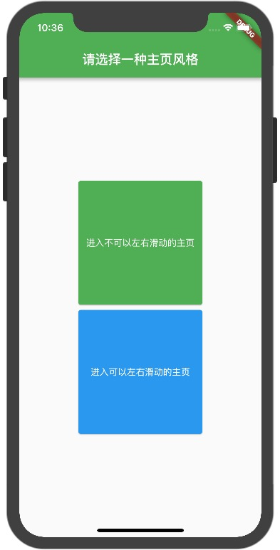
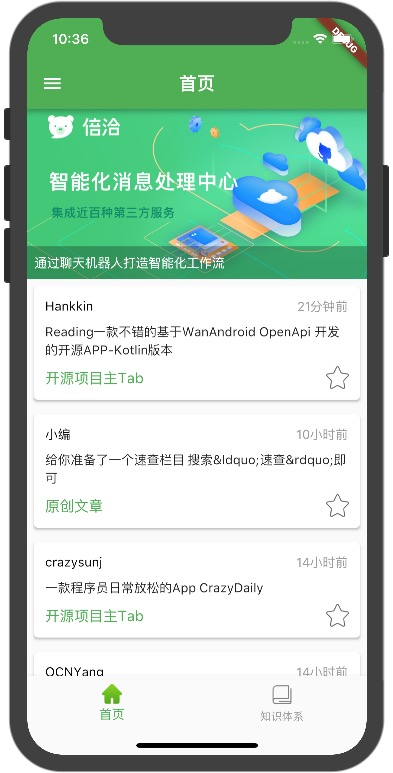
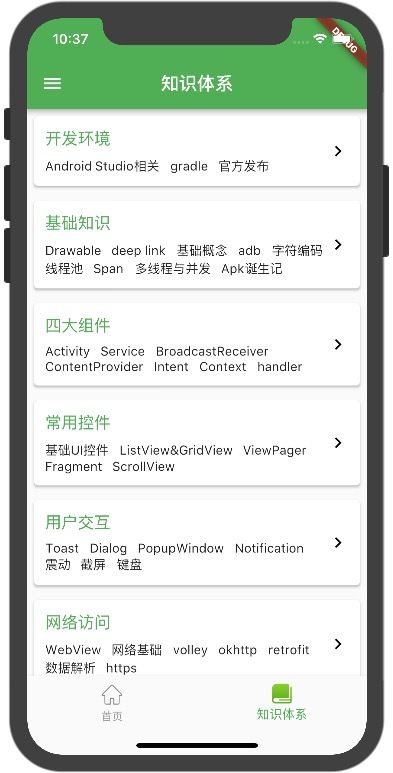
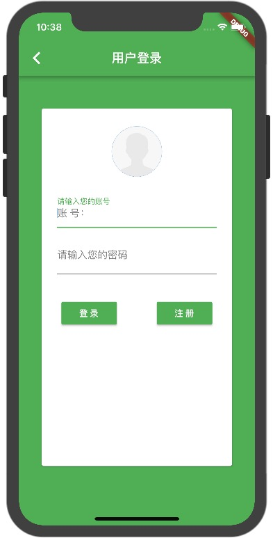
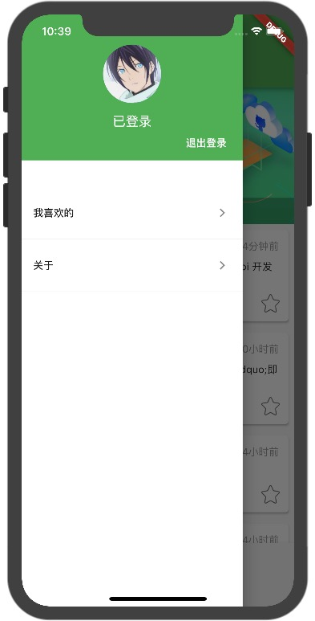
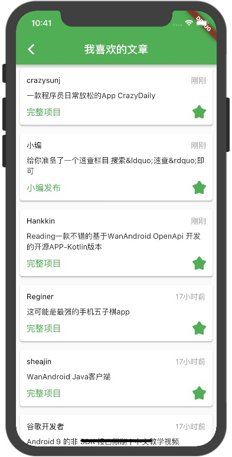
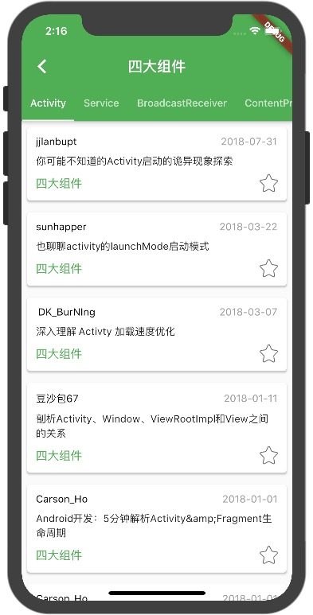

# wan_android_flutter

Wan Android Flutter application.

WanAndroid  App
# 简介
最近看到各大技术论坛和平台都涌现了很多flutter相关的文章，
特别是一些大厂的文章，为了跟上技术迭代的步伐，只好大概的看着官方文档学习了一下。

项目是基于[Wan Android](http://www.wanandroid.com/index)提供的api来完成的，非常感谢鸿阳大神，自己也经常在这个网站上学习一些技术，做这个Flutter App的话也可以装在自己手机上平常用来看一些技术文章。

另外大部分flutter的学习参考是在这两个网站上学习的。

[官方Flutter文档地址](https://flutter.io/)

[中文Flutter文档地址](https://flutterchina.club)

这个是我用来找一些flutter plugin的地址（这是个好东西。）

[Flutter开源库查找网站](https://pub.dartlang.org/flutter)

## 目前项目里面有用到的开源库
（看命名就知道是干嘛用的了，我就不写了。）
 - cupertino_icons: ^0.1.2
 - shared_preferences: ^0.4.2
 - cached_network_image: ^0.4.1
 - fluttertoast: ^2.0.7
 - event_bus: ^1.0.1
 - flutter_webview_plugin: ^0.2.1+2

### 已完成的Wan Android Api和项目功能
 - 双首页
 - 用户登录注册
 - 首页文章列表
 - 首页Banner
 - 知识体系
 - 知识体系下的文章
 - 收藏文章管理

### 待开发功能
 - 在首页加入热门模块(包括热门搜索和热门网站)
 - 加入搜索文章的功能
 - 加入Todo功能(这个会到最后才做)
 - 结构优化（之前为了体验Flutter的开发过程，没有特意去做太多的封装和方法的抽取，后续会开始做这方面的优化调整）

### Android的安装包
[直接电脑上点击下载地址](https://github.com/ywp0919/wan_android_flutter/raw/master/android/app/release/app-release.apk)

#### 也可以扫二维码下载

## 预览图片

